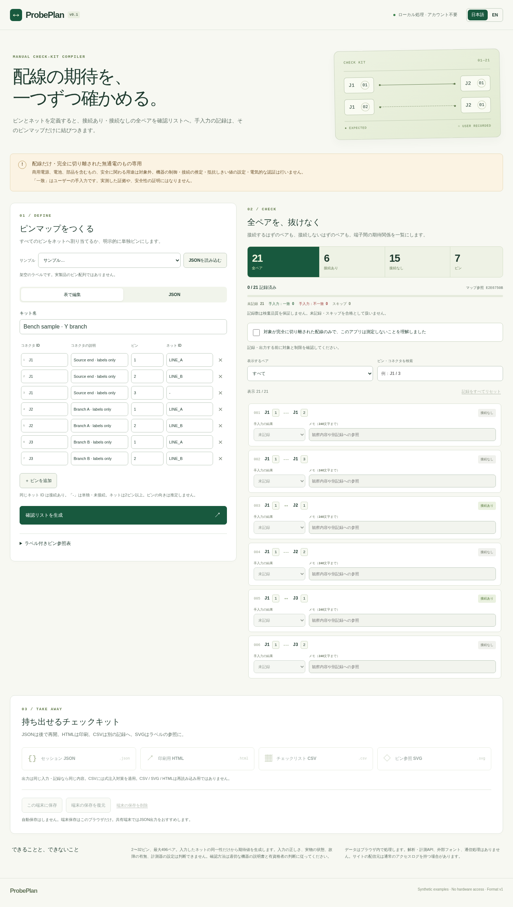

# ProbePlan

**An explicit pin map in. A complete manual check kit out.**

ProbePlan is a local-first, dependency-free browser application for preparing a manual connectivity checklist for **isolated, disconnected, wire-only passive assemblies**. It compiles every unordered pin pair, including expected non-connections, and keeps manual records bound to the exact map.

> No mains, batteries, components, energized circuits, or safety-critical use. ProbePlan does not measure anything, control hardware, infer pinouts, choose resistance thresholds, or certify electrical safety. A “User pass” is a person’s entry, not measured evidence.

## Verified preview



[Hosted verification](https://github.com/Masanori-Spec/probe-plan/actions/runs/37170948046) passed for `5bb9c7e60bab2f0a8ace294054cc10d07d440446`: 95 tests on each of four Node/timezone combinations and all 16 sandboxed Chromium scenarios. Desktop/mobile screenshots, actual JSON/CSV/HTML/SVG downloads, and two print PDFs were reviewed. [Evidence and limits](docs/verification.md).

## 日本語

ピンとネットの定義から、接続あり・接続なしの**全ペア確認リスト**を生成します。2〜32ピン、最大496ペア。JSONと表形式で編集でき、手入力記録をJSON・CSV・印刷用HTML・ラベル付きSVGへ出力できます。

- 全ピンをネットへ割り当てるか、明示的に単独ピンとして扱います
- 入力編集中は記録・出力をロック。マップ変更の適用時に全記録を無効化します
- 「未記録・手入力：一致・手入力：不一致・スキップ」を区別します
- 日本語 / 英語、モバイル対応、キーボード操作、端末保存とJSON再開に対応する設計です
- サンプルは架空のラベルです。実際の製品のピン配置ではありません
- 配線のみの完全に切り離された無通電のもの専用。電源・電池・部品を含むもの、電気安全の判定、安全に関わる用途には使えません

画面の記録は実測した証拠ではありません。具体的な確認方法や測定条件は提供しません。実物の確認では適切な機器の説明書と有資格者の判断に従ってください。

## Run locally

Node.js 22 or newer:

```sh
npm run build
npm run serve
# Open http://127.0.0.1:4173
```

The browser bundle uses only native web APIs. No runtime packages or external fonts are loaded. The development server listens on loopback only. Serve `dist/` from a static host to deploy; do not open the module-based application directly with `file://`. A downloaded printable HTML report is standalone and can be opened directly.

```sh
npm ci --ignore-scripts
npm run check
# In an environment that supports Chromium's sandbox:
npx playwright install --with-deps chromium
npm run build
npm run serve
# In a second terminal:
npm run test:browser
```

Do not disable Chromium’s sandbox to run these checks. The GitHub workflow uses `ubuntu-22.04` for the browser job and `chromiumSandbox: true`. Its runner compatibility baseline will need maintenance before the announced 2027-04-17 retirement. Model tests run on Node 22 / 24 in UTC / Asia/Tokyo.

## A five-minute walkthrough

1. Start with the synthetic Y-branch sample: 7 pins, 21 pairs, 6 expected connections, 15 expected non-connections
2. Review all declared pin labels, connector descriptions, and net assignments. The reference is a logical roster, **not a connector face view**
3. Review the application’s scope acknowledgement. Enter results individually; there is no bulk “pass all” control
4. Filter untested, expected-connected, expected-not-connected, or failed/skipped pairs
5. Export session JSON to resume later, HTML for print, CSV for a separate record, or SVG for the pin reference
6. Change one net assignment or label. Until regeneration, recording and export are locked. Applying a changed map resets every manual result and note after confirmation

Device saving is explicit, never automatic. Restore/import asks before replacing dirty input or entered records. Scope acknowledgement is deliberately not restored. Clearing device storage requires confirmation. Directly printing the application produces a visibly labelled screen view that may be filtered or include unapplied edits; export Printable HTML for the complete compiled kit. A browser’s storage can be unavailable or cleared; retain JSON copies when the records matter.

## Input contract

`examples/straight.json` is the smallest useful starting example. The map has exactly these fields:

```json
{
  "schema": "probeplan.pinmap.v1",
  "title": "Synthetic two-pin sample",
  "connectors": [
    { "id": "A", "label": "End A", "pins": ["1"] },
    { "id": "B", "label": "End B", "pins": ["1"] }
  ],
  "nets": [
    { "id": "WIRE", "pins": [
      { "connector": "A", "pin": "1" },
      { "connector": "B", "pin": "1" }
    ] }
  ],
  "unused": []
}
```

- Declare 2–32 total pins. Connector IDs are unique. Pin labels are unique within each connector
- Every declared pin must appear **exactly once** in a net or in `unused`; undeclared references and overlapping assignments are errors
- A net must have at least two pins. Each unused pin is independently isolated, including from every other unused pin
- Connector and net IDs: 1–24 characters from `A–Z a–z 0–9 _ -`. IDs are case-sensitive
- Pin labels: 1–24 UTF-16 code units; connector descriptions: 1–48; title: 1–80; result notes: 0–240
- Text must be Unicode NFC with no surrounding whitespace, control / bidi-control characters, unpaired surrogates, or U+FFFE/U+FFFF. Emoji represented by valid pairs are accepted; length is not a grapheme count
- JSON is limited to 1,000,000 UTF-8 bytes and 20 nesting levels. Duplicate keys (including escaped aliases), unknown fields, invalid JSON grammar, and non-finite numbers are rejected
- In the table editor, `-` in the net column means isolated. The net ID `-` is reserved and rejected in JSON as well
- Arrays are canonically sorted by case-sensitive code-unit order, so pin `10` precedes `2`. Reordering input does not invalidate records

## Outputs and integrity

| Format | Purpose | Import supported? |
| --- | --- | --- |
| `probeplan.session.v1` JSON | Exact map and one record per pair | Yes |
| CSV | Interchange with spreadsheets and external recordkeeping | No |
| HTML | Standalone printable checklist, summary, and pin reference | No |
| SVG | Labelled logical pin roster, with net/isolated labels | No |

The binding is the **complete canonical map JSON**, not the short visual reference code. Records are checked against that binding on import and before every export. A change to a title, connector description, pin list, net ID, or membership conservatively resets every result. A raw session with a changed map and stale binding is rejected. A session with missing, duplicate, extra, or unknown pair records is rejected.

The 8-digit display reference is a non-cryptographic convenience label. It is not a signature, a unique global ID, or a tamper-proof audit trail. Anyone can edit both a saved map and its binding or invent manual records. There are no identities, timestamps, calibration records, provenance signatures, or measured evidence.

Exports are deterministic for a given validated session and export language. JSON and CSV values remain language-independent. CSV prefixes formula-like cells with an apostrophe and quotes every cell; that protection intentionally changes formula-leading display values. HTML/SVG escape user-controlled markup. Reports contain no scripts or external assets. Very long SVG labels use reduced font size and explicit SVG textLength containment. Full text is retained; ordinary labels keep their original typography.

## Architecture and tests

- `src/core.mjs`: strict JSON, schema/accounting validation, canonicalization, full pair enumeration, record binding, invalidation
- `src/table.mjs`: row-to-map adapter with explicit accounting
- `src/export.mjs`: deterministic JSON / CSV / HTML / SVG
- `src/app.mjs`: staged edits, record workflow, import/download, explicit device storage
- `tests/oracle.test.mjs`: independently enumerated set partitions; does not reuse the compiler to decide expected connectivity
- `tests/app-state.test.mjs`: DOM-stub event/state regressions for delayed import cancellation, changing status filters, and print-state warnings (not a browser substitute)
- `tests/core.test.mjs`: adapters, examples, deterministic exports, scope text, and long-label fitting
- `tests/browser/browser-test.mjs`: sandboxed end-to-end workflow, downloads, print PDF, keyboard, responsive screenshots, repeated/cancelled flows, and unavailable-storage handling

The independent oracle enumerates all set partitions for 2–7 pins and compares every intended partition against every physical-partition model of the same size: **813,296 comparisons**. This verifies the abstract equivalence-relation model only, not the real-world behavior of cables or meters.

Current verified evidence: **95 / 95 Node tests passed** on Node 22/24 in UTC/Asia/Tokyo; syntax/no-network guard and static build passed. **16 / 16 sandboxed Chromium scenarios passed** in hosted CI. Desktop/mobile layouts, wide-label SVGs, actual downloads and print pagination were inspected. This is browser-viewport testing, not physical-device or electrical verification. See [verification](docs/verification.md).

## Deliberate limits

- No physical measurements or electrical instructions; the model treats net membership as a binary relation
- No practical fault-detection guarantee: intermittency, resistance, fixture contact, misidentification, meter settings, leakage, insulation, load behavior, and timing are outside the model
- No inferential shortcut or reduced test basis. Every unordered pair is listed
- No connector drawing library, pinout database, import from proprietary formats, hardware integration, or collaboration
- No BOM, manufacturing file generation, or cable routing
- No claim of product novelty, comprehensive market coverage, validated demand, or replacement for hardware testing
- No automatic storage, synchronization, or protection against a malicious user editing records

[Research and comparison](docs/comparison.md) · [Architecture and interview explanation](docs/engineering.md) · [Verification scope](docs/verification.md)

No project license has been selected or added. Publication does not by itself grant a reuse license.
